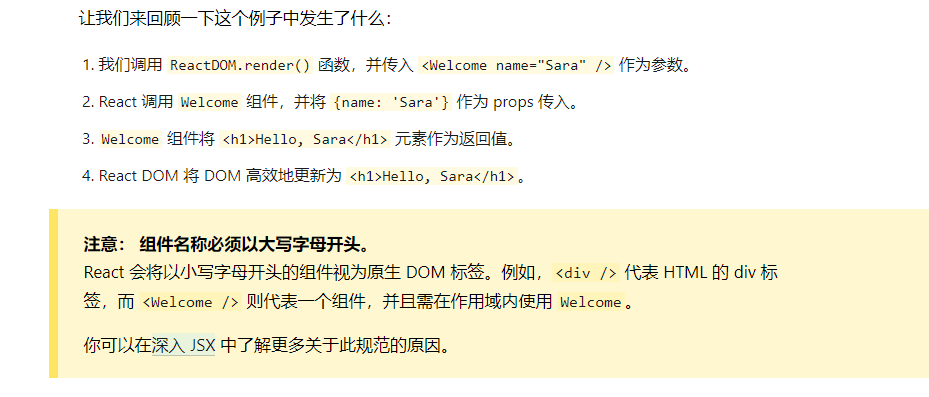

### 定义组件

- 编写 js 函数来定义组件

```js
function Welcome(props) {
  return <h1>Hello,{props.name}</h1>;
}
```

- 利用 ES6 的 class 来定义组件

```js
class Welcome extends React.Component {
  render() {
    return <h1>Hello, {this.props.name} </h1>;
  }
}
```

> `props`是标签(组件)里的 attributes 如<div data1='23' data2='ab'></div>中的 data1 和 data2 都是包含在 props 里，可以通过 props.的方式来访问。`props`***只可读，不可修改***，不能修改`props`中的数据,只能通过外部组件主动传入新的props来重新渲染子组件，否则子组件的props以及展现形式不会改变

### 用户自定义组件

```js
// 1.DOM标签
const element = <div />;
```
```js
// 2.用户自定义组件

// 2.1 自定义组件
function Welcome(props){
    return <h1>Hello, {porps.name}</h1>;
}
// 2.2 使用自定义组件
const element = <Welcome name='lihua' />;
ReactDOM.render(
    element,
    document.getElementById('root')
)
```
**上述操作的处理过程**

### 嵌套使用组件
#### 1.组合组件
**可以在组件里嵌套使用其他组件**
```js
// 创建Welcome组件
function Welcome(props){
    return <h1>Hello,{props.name}</h1>;
}
// 创建App组件
function App(){
    return (
        <div>
            <Welcome name='zhangsan' />
            <Welcome name='lisi' />
        </div>
    );
}
// 渲染组件
ReactDOM.render(
    <App />,
    document.getElementById('root')
);
```

#### 2.拆分组件
- 未拆分前
```js
// 这里实现的使用一个用户评论的组件，内容信息包括用户的头像、名称、评论内容已经评论时间
function Comment(props) {
  return (
    <div className="Comment">
      <div className="UserInfo">
        
        <div className="UserInfo-name">
          {props.author.name}
        </div>
      </div>
      <div className="Comment-text">
        {props.text}
      </div>
      <div className="Comment-date">
        {formatDate(props.date)}
      </div>
    </div>
  );
}
```
- 拆分后
```js
    // 1.头像组件
    function Avatar(props){
        return (
            
        );
    }
    // 2.用户信息组件
    function UserInfo(props){
        return (
            <div className='Comment'>
                <Avatar user={props.user} />
                <div className='UserInfo-name'>
                    { props.user.name }
                </div>
            </div>
        );
    }
    // 3.简化后的最终结果
    function Comment(props){
        return (
            <div className='Comment'>
            <UserInfo user={props.author} />
            <div className='Comment-text'>
                {props.text}
            </div>
            <div className='Comment-date'>
                {formatDate(props.date)}
            </div>
            </div>
        )
    }
```